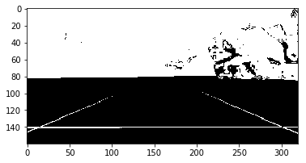
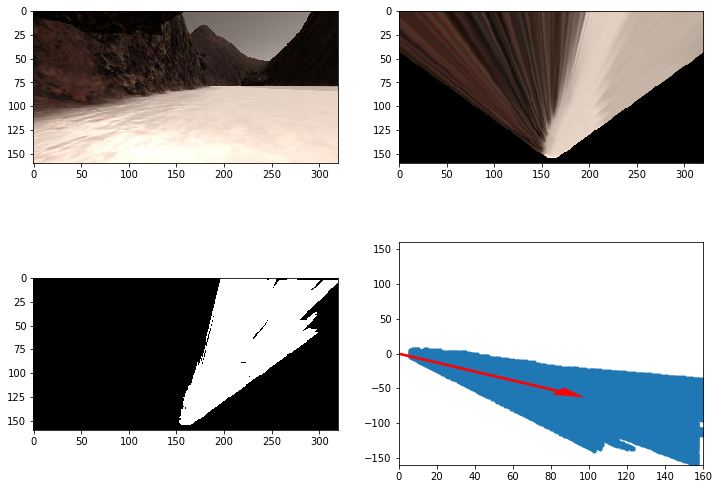
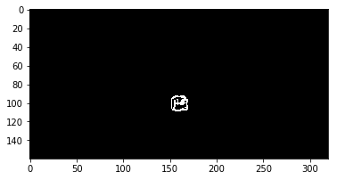

## Project: Search and Sample Return
### Writeup Template: You can use this file as a template for your writeup if you want to submit it as a markdown file, but feel free to use some other method and submit a pdf if you prefer.

---

**The goals / steps of this project are the following:**  

**Training / Calibration**  

* Download the simulator and take data in "Training Mode"
* Test out the functions in the Jupyter Notebook provided
* Add functions to detect obstacles and samples of interest (golden rocks)
* Fill in the `process_image()` function with the appropriate image processing steps (perspective transform, color threshold etc.) to get from raw images to a map.  The `output_image` you create in this step should demonstrate that your mapping pipeline works.
* Use `moviepy` to process the images in your saved dataset with the `process_image()` function.  Include the video you produce as part of your submission.

**Autonomous Navigation / Mapping**

* Fill in the `perception_step()` function within the `perception.py` script with the appropriate image processing functions to create a map and update `Rover()` data (similar to what you did with `process_image()` in the notebook). 
* Fill in the `decision_step()` function within the `decision.py` script with conditional statements that take into consideration the outputs of the `perception_step()` in deciding how to issue throttle, brake and steering commands. 
* Iterate on your perception and decision function until your rover does a reasonable (need to define metric) job of navigating and mapping.  

## [Rubric](https://review.udacity.com/#!/rubrics/916/view) Points
### Here I will consider the rubric points individually and describe how I addressed each point in my implementation.  

---
### Writeup / README

#### 1. Provide a Writeup / README that includes all the rubric points and how you addressed each one.  You can submit your writeup as markdown or pdf.  

You're reading it!

### Notebook Analysis
#### 1. Run the functions provided in the notebook on test images (first with the test data provided, next on data you have recorded). Add/modify functions to allow for color selection of obstacles and rock samples.

Thresholded Terrain

Thresholded Navigable Terrain

Thresholded rock image

#### 1. Populate the `process_image()` function with the appropriate analysis steps to map pixels identifying navigable terrain, obstacles and rock samples into a worldmap.  Run `process_image()` on your test data using the `moviepy` functions provided to create video output of your result. 
The implementation for `process_image()` is pretty straightforward. First I defined source and destination points to apply the perspective transform. I then applied color thresholding for rocks, obstacles and terrain.   

We then take the binary images and calculate the rover-frame coordinates of non-zero pixels in the binary image. We then convert those to the world coordinate frame. We then take those world-frame coordinates of rock, terrain and obstacles and overlay it with our ground truth worldmap. All different intermediate transforms are then recorded as a video.

### Autonomous Navigation and Mapping

#### 1. Fill in the `perception_step()` (at the bottom of the `perception.py` script) and `decision_step()` (in `decision.py`) functions in the autonomous mapping scripts and an explanation is provided in the writeup of how and why these functions were modified as they were.

The implementation of `perception_step()` is very similar to process image. The only difference is that we're saving values to the Rover object.

At this point the Rover performs well in the simulator but sometime's misses a few lanes. To improve this I thought it'd be better if the Rover followed the obstacle wall. So I manipulated the steering step to add an angle offset to the calculated mean navigable angle to the left. This improved it by a bit but the Rover sometimes had trouble recovering from an obstacle (by turning right). So I added reduced the angle offset when the mean angle (to the right) was above a certain threshold so that the Rover can steer away from an obstacle.

This helped the Rover map the environment better, but had some trouble when navigating around rocks a lower graphics setting simulator.

I also added a condition where the Rover is near a sample to stop immediately. Although it sounds intuitive, the Rover didn't pick up any samples in my test runs.

#### 2. Launching in autonomous mode your rover can navigate and map autonomously.  Explain your results and how you might improve them in your writeup.  

**Note: running the simulator with different choices of resolution and graphics quality may produce different results, particularly on different machines!  Make a note of your simulator settings (resolution and graphics quality set on launch) and frames per second (FPS output to terminal by `drive_rover.py`) in your writeup when you submit the project so your reviewer can reproduce your results.**

Most of my approach was detailed in the explanation of `decision.py`. The Rover did not pick up any sample in my test runs. More work is needed to check proximity to rocks and how to navigate towards them. I haven't meddled with the Rover speed as well, it needs to slow down when approaching a rock or uncertain territory. Since I went until 2 decision steps based on angle, it's clear to see that the offset angle should vary proportionally as well.

The settings I used for the simulator were 1024x768 at Good resolution with 37-38 FPS.

